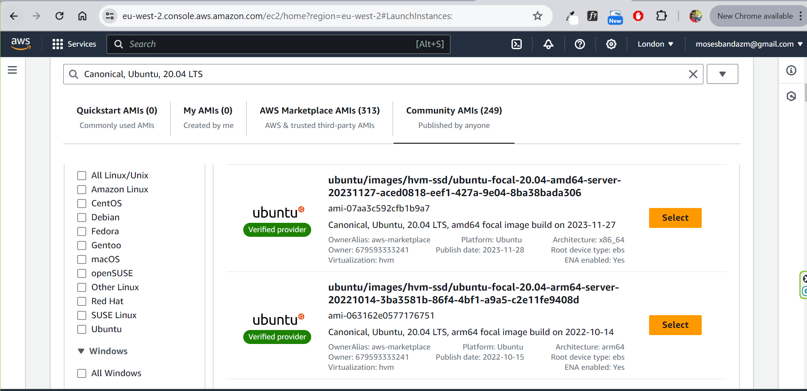
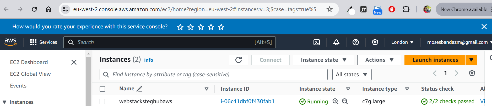

## Setting up and provisioning on Ubuntu server on AWS:

# Step 1: Create an AWS Account

# To create a new AWS account, go to aws.amazon.com and choose Create an AWS Account.

# 1 - Enter an email address and an account name.

* Carefully consider which email address you want to use. If you are setting up for a personal account, we don't recommend using a work email address because you may change jobs at some point. Conversely, for business accounts, we recommend using an email alias that can be managed because the person setting up the account may, at some point, change roles or companies. 

# 2 - Select Verify email address.

* You will get a verification code in your email. Enter the verification code and choose Verify.
You will be redirected to a new screen where you will create your root user password.

# 1.3 - Create your root user password.

* The password you choose is extremely sensitive, and should be shared only with people who have access to the credit card that will be used on this account.

* Your password must include: uppercase letters, lowercase letters, numbers, and non-alphabetic characters. 

# 1.4 - Once you have entered and confirmed your password, choose Continue


##  Add contact information 

# 1 - Choose between a business or personal account.

* There is no difference in account type or functionality, but there is a difference in the type of information required to open the account for billing purposes. 
* For a business account, choose a phone number that is tied to the business and can be reached if the person setting up the account is not available.

# 2 - Once you have selected the account type, fill out the the contact information about the account.

* Save these details in a safe place. If you ever lose access to the email or your two-factor authentication device, AWS Support can use these details to confirm your identity. 


# 3 - At the end of this form, please read through the terms of the AWS Customer Agreement and select the checkbox to accept them. 

# 4 - Choose Continue (step 2 of 5) to proceed to the next screen.

# Add a payment Method 

# 1 - Enter your Billing Information details.

* A small hold will be placed on the card, so the address must match what your financial institution has on file for you or your business. 

# 2 - Select Verify and Continue (step 3 of 5) to proceed.

# Confirm your identy

# 1 - Choose how you want to confirm your identity.

* You can verify your account either through a text message (SMS) or a voice call on the number you are associating with this account.
* For the text message (SMS) option, you will be sent a numeric code to enter on the next screen after you choose Send SMS. 
* For the Voice call option, you will be shown a code on the screen to enter after being prompted by the automated voice verification system. 

# 2 - Enter the code as appropriate for your verification choice, then choose Continue to proceed to the final step.

# Step 2: Create an Ubuntu Server Instance

* Log in to the AWS Management Console


* Navigate to the EC2 dashboard


* Click on "Launch Instance" 


* Choose the Ubuntu Server image



* Choose the instance type and configure the settings as desired


* EC2 Instance




#### Conect to EC2 Instance via SSH
Before connecting to the instance, chnage the permission for the downloaded ssh key  to ensure your key is not publicly viewable with the command below:

```bash
sudo chmod 400 <private-key-name>.pem
```

After chnaging the permission . connect to the instance with the command below:

```bash
ssh -i "<private-key-name>.pem" ubuntu@<ip-address or dns-name>
```
