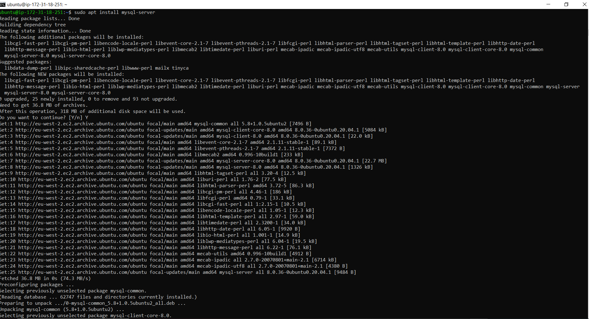
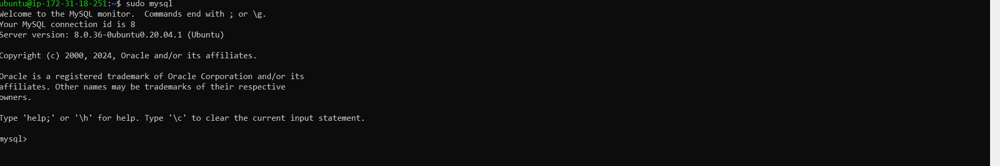
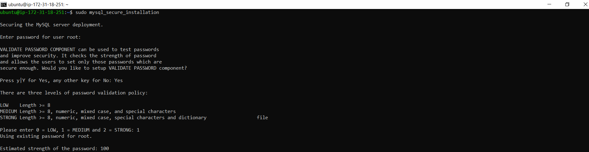
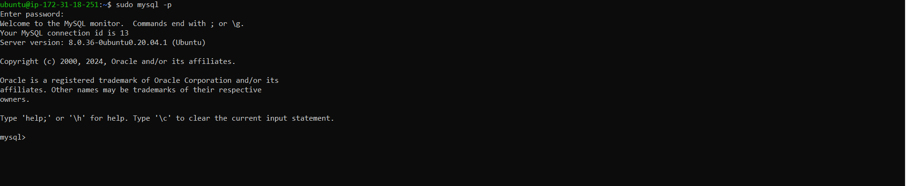

## INSTALL MYSQL

* 1. Install MySQL

```bash
 sudo apt install mysql-server
```



* 2. Log in to MySQL

```bash
 sudo mysql
```




* 3. Run Security Script to remove defaule insecure settings on MySQL

```bash
mysql> ALTER USER 'root'@'localhost' IDENTIFIED WITH mysql_native_password BY 'PassWord.1';
```


* 4. Exit MySQL

```bash
    mysql> exit
```


* 5. Start Interactive script

```bash
    sudo mysql_secure_installation
```




* 6. Test if you can login on MySQL console

```bash
    sudo mysql -p 
```



* 7. Exit MySQL

```bash
    mysql> exit
```


