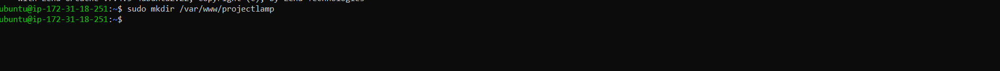
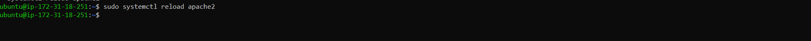
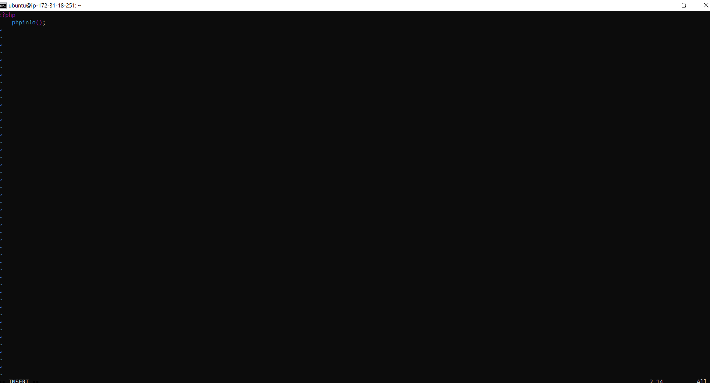
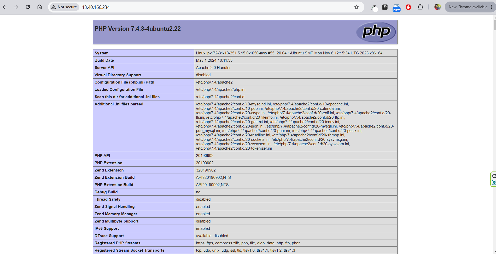

## Enable PHP on website

* 1. Change website startup behavior

```bash
 sudo vim /etc/apache2/mods-enabled/dir.conf
```



* 2. Change website startup behavior

```bash
 <IfModule mod_dir.c>
        # DirectoryIndex index.html index.cgi index.pl index.php index.xhtml index.htm
        DirectoryIndex index.php index.html index.cgi index.pl  index.xhtml index.htm

</IfModule>
```


* 3. Apache Reload

```bash
    sudo systemctl reload apache2
```




* 4. Create a new file named index.php

```bash
    sudo vim /var/www/projectlamp/index.php
```


* 5. Edit index.php

```bash
    sudo vim /var/www/projectlamp/index.php
```





