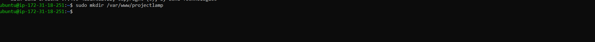

## CREATE A VIRTUAL HOST FOR YOUR WEBSITE USING APACHE

* 1. Create virtual host directory

```bash
 sudo mkdir /var/www/projectlamp
```



* 2. Assign ownership of directory

```bash
 sudo chown -R $USER:$USER /var/www/projectlamp
```


* 3. Create a new configuration file in Apache's sites-available

```bash
 sudo vi /etc/apache2/sites-available/projectlamp.conf
```


* 4. Bare bones Configurarion file 

```bash

 <VirtualHost *:80>
    ServerName projectlamp
    ServerAlias www.projectlamp
    ServerAdmin webmaster@localhost
    DocumentRoot /var/www/projectlamp
    ErrorLog ${APACHE_LOG_DIR}/error.log
    CustomLog ${APACHE_LOG_DIR}/access.log combined
 </VirtualHost>
```


* 5. Show New file in sites-available

```bash
 sudo ls /etc/apache2/sites-available
```


* 6. Enable new virtual host

```bash
 sudo a2ensite projectlamp
```


* 7. Run Apache Reload

```bash
 sudo systemctl reload apache2
```


* 8. Disable Apache default website

```bash
 sudo a2dissite 000-default
```


* 9. Make sure configuration file does not contain syntax error 

```bash
 sudo apache2ctl configtest
```


* 10. Run Apache Reload

```bash
 sudo systemctl reload apache2
```


* 11. Create index.html

```bash
 sudo vi /var/www/projectlamp/index.html
```


* 12. Edit index.html

```bash
    sudo echo 'Helo LAMP from hostname' $(curl -s http://172.31.18.251/latest/meta-data/public-hostname) 'with public IP' $(curl -s http://172.31.18.251/latest/meta-data/public-ip4) > /var/www/projectlamp/index.html
```


