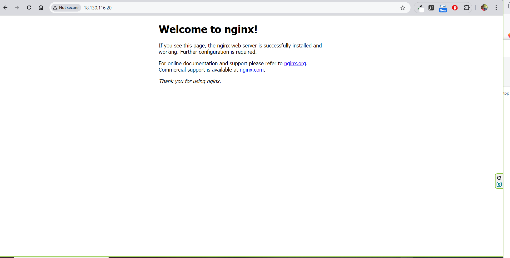
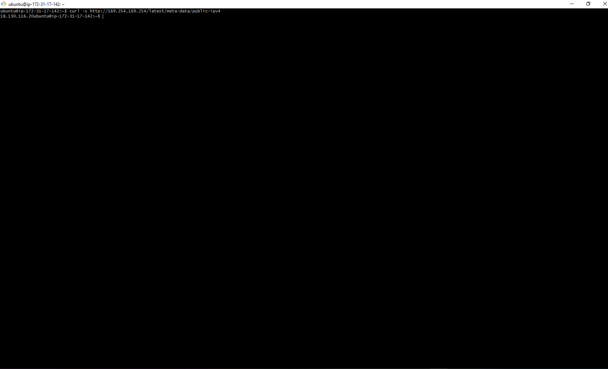

## NGINX

# INSTALL NGINX

* 1. Installing nginx web server

```bash
    sudo apt update
    sudo apt install nginx
```


* 2. Nginx Status

```bash
    sudo systemctl status nginx
```


* 3. Access Nginx locally

```bash
    curl http://localhost:80
    or 
    curl http://127.0.0.1:80
```


* 4. Access Nginx using IP Address

```bash
    curl http://<PUBLIC IP>:80
   
```




* 4. Getting your Public IP Address

```bash
    curl -s http://169.254.169.254/latest/meta-data/public-ipv4
   
```

