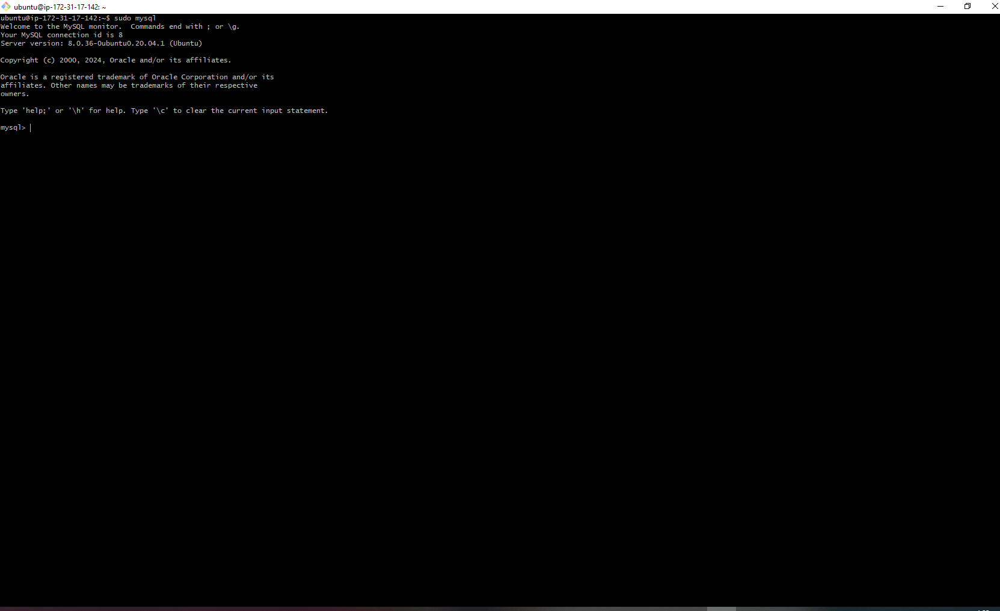
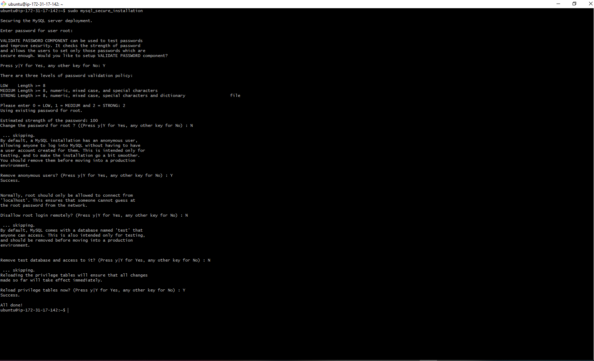

## NGINX

# INSTALL MYSQL

* 1. Installing MySQL

```bash
    sudo apt install mysql-server
```


* 2. Log in to the MySQL Console

```bash
    sudo mysql
```



* 3. Run security script

```bash
    ALTER USER 'root'@'localhost' IDENTIFIED WITH mysql_native_password BY 'PassWord.1';
```


* 4. Exit MySQL

```bash
    mysql> exit
```


* 5. Start Interactive script

```bash
    sudo mysql_secure_installation
```



* 6. Test if you can login on MySQL console

```bash
    sudo mysql -p 
```


* 7. Exit MySQL

```bash
    mysql> exit
```

