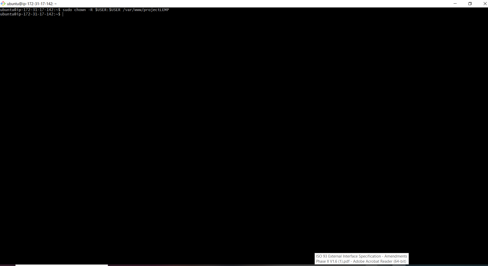
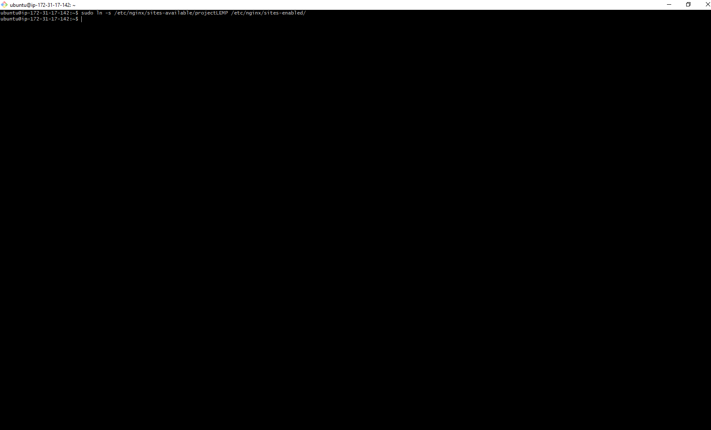
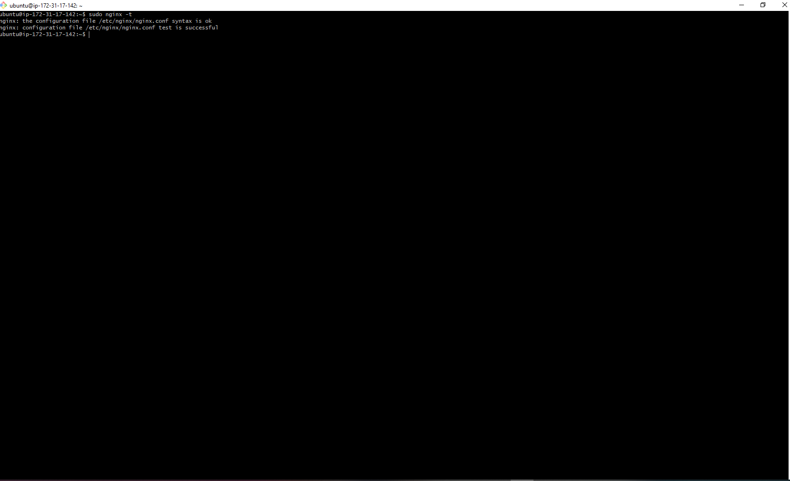
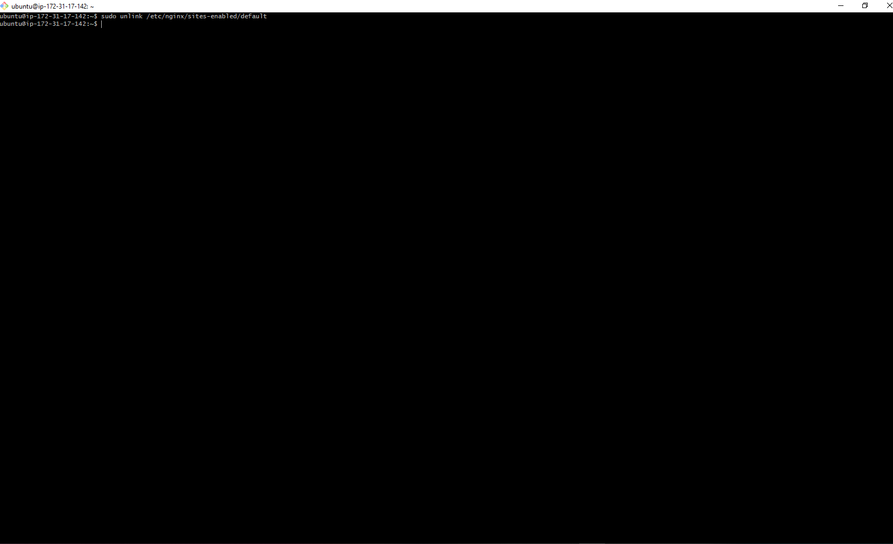
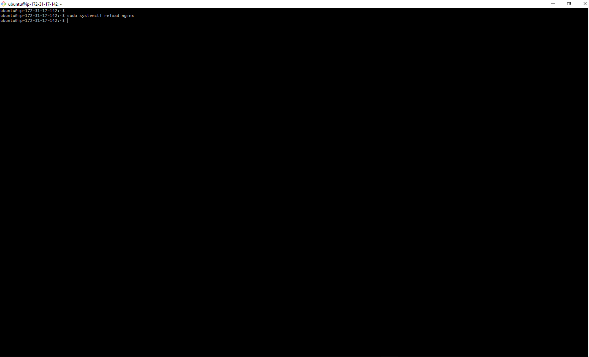
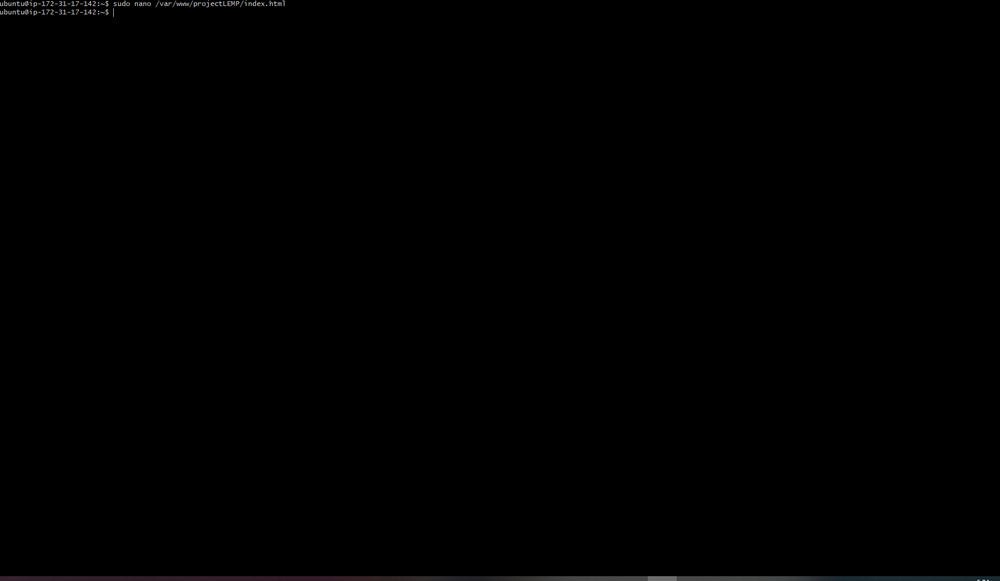
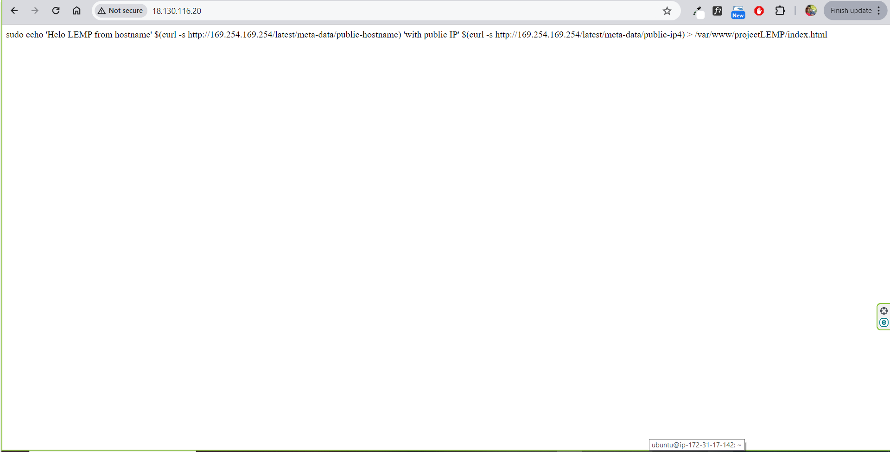

## CONFIGURE NGINX

# Configuring Nginx to use PHP Processor

* 1. Create a web directory for your domain

```bash
     sudo mkdir /var/www/projectLEMP
```


* 2. Assign ownership of directory

```bash
 sudo chown -R $USER:$USER /var/www/projectLEMP
```




* 3. Install Nano

```bash
 sudo apt install nano
```


* 4. Create a new configuration file

```bash
 sudo nano /etc/nginx/sites-available/projectLEMP
```


* 5. Create a new configuration file

```bash
#/etc/nginx/sites-available/projectLEMP

server {
    listen 80;
    server_name projectLEMP www.projectLEMP;

    root /var/www/projectLEMP;

    index index.html index.htm index.php;

    location / {
        try_files $uri $uri/ =404;
    }

    location ~ \.php$ {
        include snippets/fastcgi-php.conf;
        fastcgi_pass unix:/var/run/php/php7.4-fpm.sock;
   }

    location ~ /\.ht {
        deny all;
    }
}
```


* 6. Activate new configuration file

```bash
 sudo ln -s /etc/nginx/sites-available/projectLEMP /etc/nginx/sites-enabled/
```



* 7. Test for syntax errors

```bash
 sudo nginx -t
```



* 8. Disable Default Nginx host

```bash
 sudo unlink /etc/nginx/sites-enabled/default
```




* 8. Reaload Nginx 

```bash
 sudo systemctl reload nginx
```




* 8. Create index.html 

```bash
 sudo nano /var/www/projectLEMP/index.html
```



* 9. Edit index.html 

```bash
    sudo echo 'Helo LEMP from hostname' $(curl -s http://169.254.169.254/latest/meta-data/public-hostname) 'with public IP' $(curl -s http://169.254.169.254/latest/meta-data/public-ip4) > /var/www/projectLEMP/index.html
```


* 10. Access index.html using IP address

```bash
    http://<PUBLIC IP Address>:80
```




* 11. Access index.html using IP address

```bash
    http://<PUBLIC DNS Name>:80
```


