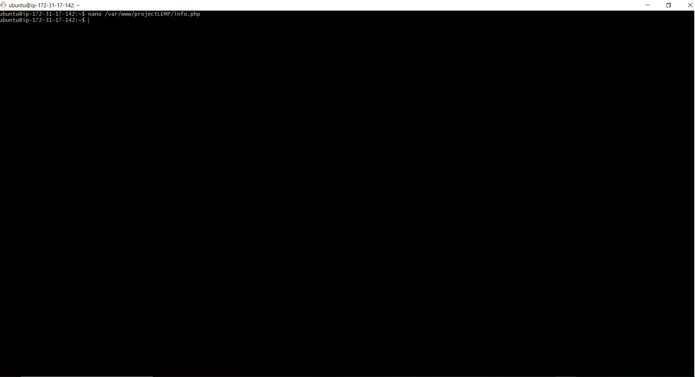
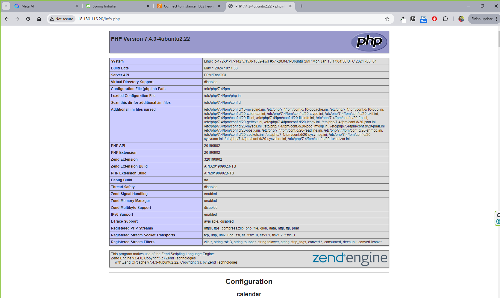
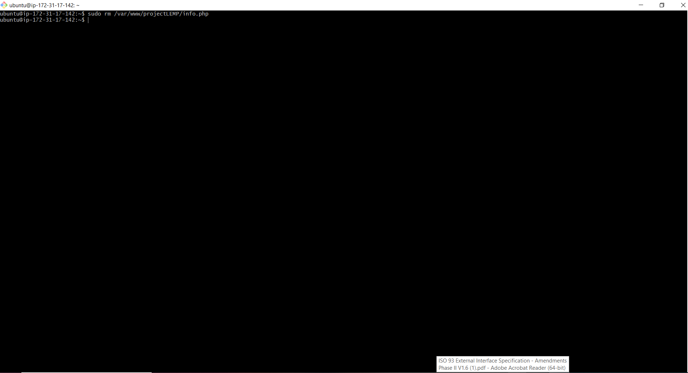

## TEST PHP NGINX

# Testing PHP with Nginx

* 1. Create Test PHP File

```bash
     nano /var/www/projectLEMP/info.php
```




* 2. PHP Valid Code

```bash
     <?php 
     phpinfo();
     
```


* 3. Access info.php

```bash
    http://server_domain_or_ip/info.php
     
```



* . Remove info.php

```bash
    sudo rm /var/www/projectLEMP/info.php
     
```

