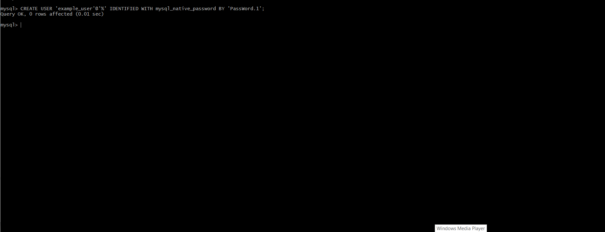
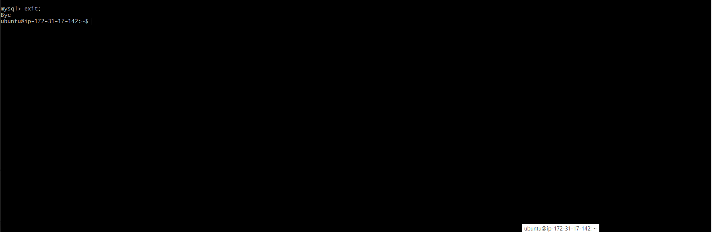
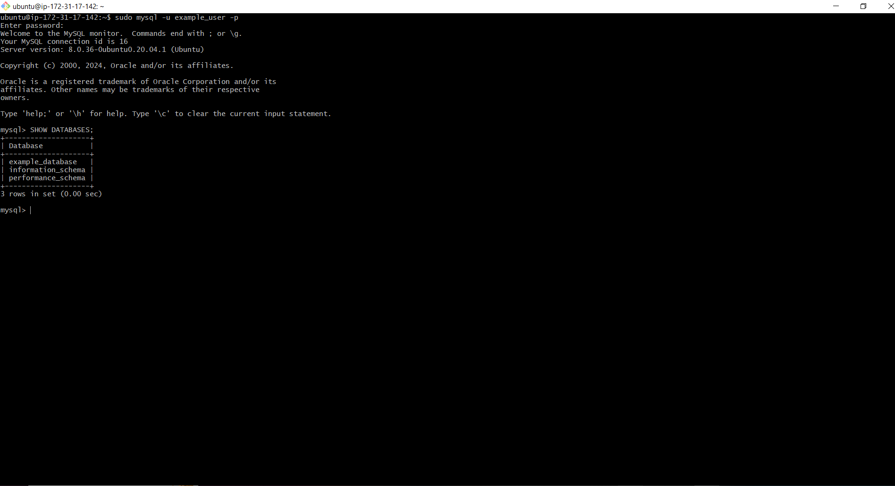
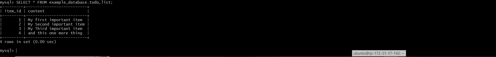
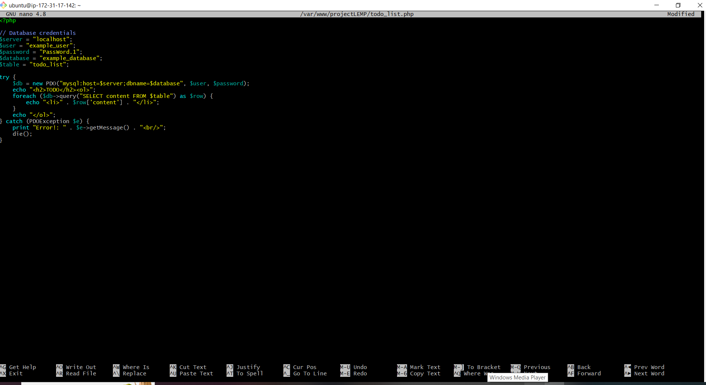

## 107- MYSQL DATABSE WITH PHP

# Retrieving data from MYSQL database with PHP 

* 1. Connect to the MySQL console using root account 

```bash
     sudo mysql -u root -p
```


* 2. Create new database 

```bash
    CREATE DATABASE example_database;
```


* 3. Create new user 

```bash
    CREATE USER 'example_user'@'%' IDENTIFIED WITH mysql_native_password BY PassWord.1';
```



* 4. Grant permissions to new user 

```bash
    GRANT ALL ON example_database.* TO 'example_user'@'%';

```


* 5. Exit

```bash
    mysql> exit;

```



* 6. Connect to the MySQL console using root account 

```bash
     sudo mysql -u example_user -p
```


* 7. Show Databases

```bash
     mysql> SHOW DATABASES;
```




* 7. Create todo_list table 

```bash
    mysql> CREATE TABLE example_database.todo_list (
    ->     item_id INT AUTO_INCREMENT PRIMARY KEY,
    ->     content VARCHAR(255)
    -> );

```


* 7. Insert a few rows 

```bash
    mysql> INSERT INTO example_database.todo_list (content) VALUES ("My first important item");
    mysql> INSERT INTO example_database.todo_list (content) VALUES ("My Second important item");
    mysql> INSERT INTO example_database.todo_list (content) VALUES ("My Third important item");
    mysql> INSERT INTO example_database.todo_list (content) VALUES ("and this one more thing");

```


* 7. Display inserted rows

```bash
    mysql> SELECT * FROM example_database.todo_list;
    
```



* 8. Exit

```bash
    mysql> exit;

```


* 9. Exit

```bash
    nano /var/www/projectLEMP/todo_list.php

```


 
 
* 10. Exit

```bash
    <?php

        // Database credentials
        $server = "localhost";
        $user = "example_user";
        $password = "PassWord.1";
        $database = "example_database";
        $table = "todo_list";

        try {
            $db = new PDO("mysql:host=$server;dbname=$database", $user, $password);
            echo "<h2>TODO</h2><ol>";
            foreach ($db->query("SELECT content FROM $table") as $row) {
                echo "<li>" . $row['content'] . "</li>";
            }
            echo "</ol>";
        } catch (PDOException $e) {
            print "Error!: " . $e->getMessage() . "<br/>";
            die();
        }

```


 * 11. Access info.php

```bash
    http://Public_domain_or_IP/todo_list.php
     
```

