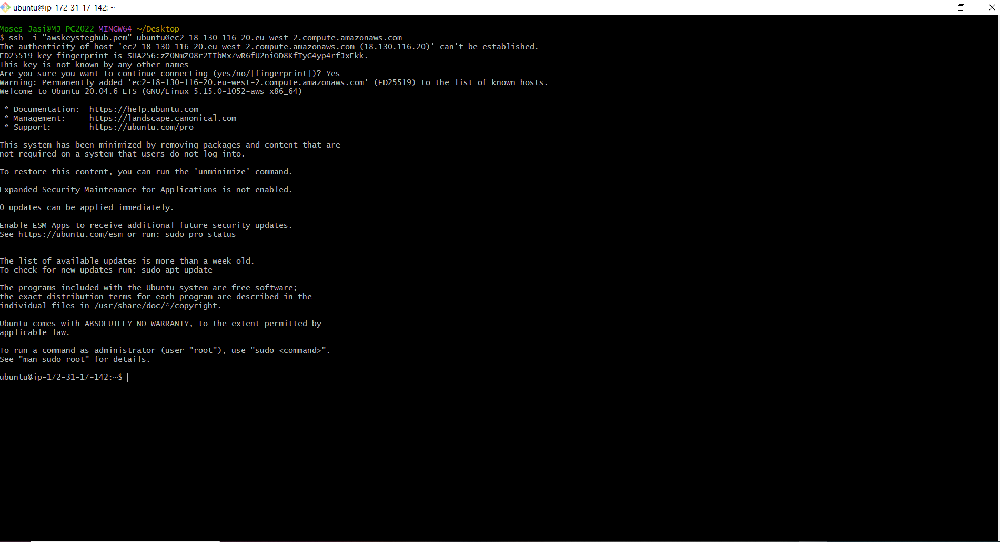
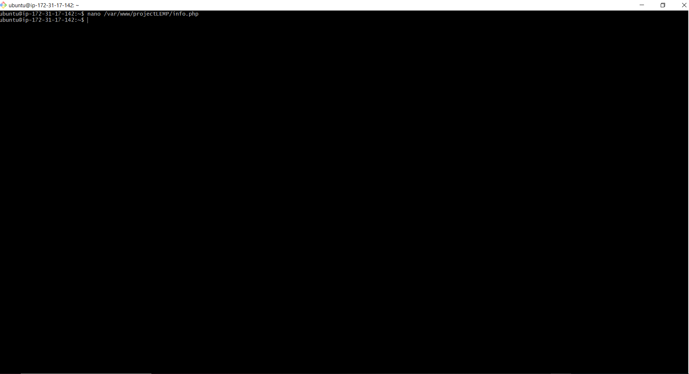

## Download and Install Git Bash 

# Download the Git Bash setup from the official website: https://git-scm.com/

* Download the installer.
* Run the .exe file you just downloaded and follow the instructions in the installer. ​
* Run Git Bash by right-clicking on any folder and selecting the Git Bash Here option from the context menu(right-click menu).


* 1. Open EC2 in Git Bash

```bash
    ssh -i "<Your private-key.pem>" ubuntu@<EC2-Public-IP-Address>
```




# SELF STUDY

# SQL Syntax and most commonly used commands

# SQL Statements

Most of the actions you need to perform on a database are done with SQL statements.

SQL statements consists of keywords that are easy to understand.

The following SQL statement returns all records from a table named "Customers":

Example
```bash
    Select all records from the Customers table:
    SELECT * FROM Customers;
 ```

# Keep in Mind That...

    SQL keywords are NOT case sensitive: select is the same as SELECT
In this tutorial we will write all SQL keywords in upper-case.

# Semicolon after SQL Statements?

Some database systems require a semicolon at the end of each SQL statement.

Semicolon is the standard way to separate each SQL statement in database systems that allow more than one SQL statement to be executed in the same call to the server.

# Some of The Most Important SQL Commands

    SELECT - extracts data from a database
    UPDATE - updates data in a database
    DELETE - deletes data from a database
    INSERT INTO - inserts new data into a database
    CREATE DATABASE - creates a new database
    ALTER DATABASE - modifies a database
    CREATE TABLE - creates a new table
    ALTER TABLE - modifies a table
    DROP TABLE - deletes a table
    CREATE INDEX - creates an index (search key)
    DROP INDEX - deletes an index


# Nano Editor and Basic Nano commands 

 *  Shortcut to opening your terminal and launching nano press ctrl+alt+t and type in nano
 * Create a file 
  ```bash
        nano note.txt
  ```
* Typing and saving 
 ```bash
        8 AM-        Lunch
        1 PM-        Tea
        5 PM-        DinnerTo save the above text file press ctrl+o then Enter key and you’re done.   
  ```
* Exiting Nano
 ```bash
       Press ctrl+x and your program exits. 
  ```

* Moving Up and Down 
 ```bash
       Press ctrl+n to move down 
       Press ctrl+p to move up
  ```

* Letter and word traversing
 ```bash
       To move your cursor one word at a time press ctrl+space 
       Reverse of moving back one word at a time is esc+space
       Press – ctrl+e to bring your cursor to the end
       Press – ctrl+a to the beginning of the current line
  ```

* Copy and paste
 ```bash
       ​To select the text; position your cursor press esc+shift+a start selecting till the end of the line
       Then press esc+6 to copy the text
       Position your cursor to last line and press ctrl+u and it’s pasted
       In case you wish to undo the selection thing press the same key combination you did to select text before i.e. esc+shift+a
  ```
* Cut and paste
 ```bash
       ​To cut text do over the “select” thing on the last line and press ctrl+k
       Position your cursor to last line and press ctrl+u and it’s pasted
  ```

* Find words
 ```bash
       You might have noticed this below status: “^W Where is”. If you’ve guessed it correctly it’s the find tool
  ```

* Find and replace
 ```bash
       To find words press esc+r 
       Type in “the word you want found” and press Enter key then type in the replacement text as “replacement”. nano will ask you if you wish to replace that instant of the word Lunch being found
       ​Press y and the word gets replaced.  
  ```


## NGINX

# INSTALL NGINX

* 1. Installing nginx web server

```bash
    sudo apt update
    sudo apt install nginx
```


* 2. Nginx Status

```bash
    sudo systemctl status nginx
```


* 3. Access Nginx locally

```bash
    curl http://localhost:80
    or 
    curl http://127.0.0.1:80
```


* 4. Access Nginx using IP Address

```bash
    curl http://<PUBLIC IP>:80
   
```


* 4. Getting your Public IP Address

```bash
    curl -s http://169.254.169.254/latest/meta-data/public-ipv4
   
```


## NGINX

# INSTALL MYSQL

* 1. Installing MySQL

```bash
    sudo apt install mysql-server
```


* 2. Log in to the MySQL Console

```bash
    sudo mysql
```


* 3. Run security script

```bash
    ALTER USER 'root'@'localhost' IDENTIFIED WITH mysql_native_password BY 'PassWord.1';
```


* 4. Exit MySQL

```bash
    mysql> exit
```


* 5. Start Interactive script

```bash
    sudo mysql_secure_installation
```


* 6. Test if you can login on MySQL console

```bash
    sudo mysql -p 
```


* 7. Exit MySQL

```bash
    mysql> exit
```


## INSTALL PHP 

* 1. Install PHP

```bash
 sudo apt install php-fpm php-mysql
```


## CONFIGURE NGINX

# Configuring Nginx to use PHP Processor

* 1. Create a web directory for your domain

```bash
     sudo mkdir /var/www/projectLEMP
```


* 2. Assign ownership of directory

```bash
 sudo chown -R $USER:$USER /var/www/projectLEMP
```


* 3. Install Nano

```bash
 sudo apt install nano
```


* 4. Create a new configuration file

```bash
 sudo nano /etc/nginx/sites-available/projectLEMP
```


* 5. Create a new configuration file

```bash
#/etc/nginx/sites-available/projectLEMP

server {
    listen 80;
    server_name projectLEMP www.projectLEMP;

    root /var/www/projectLEMP;

    index index.html index.htm index.php;

    location / {
        try_files $uri $uri/ =404;
    }

    location ~ \.php$ {
        include snippets/fastcgi-php.conf;
        fastcgi_pass unix:/var/run/php/php8.1-fpm.sock;
   }

    location ~ /\.ht {
        deny all;
    }
}
```


* 6. Activate new configuration file

```bash
 sudo ln -s /etc/nginx/sites-available/projectLEMP /etc/nginx/sites-enabled/
```


* 7. Test for syntax errors

```bash
 sudo nginx -t
```


* 8. Disable Default Nginx host

```bash
 sudo unlink /etc/nginx/sites-enabled/default
```


* 8. Reaload Nginx 

```bash
 sudo systemctl reload nginx
```


* 8. Create index.html 

```bash
 sudo nano /var/www/projectLEMP/index.html
```


* 9. Edit index.html 

```bash
    sudo echo 'Helo LEMP from hostname' $(curl -s http://169.254.169.254/latest/meta-data/public-hostname) 'with public IP' $(curl -s http://169.254.169.254/latest/meta-data/public-ip4) > /var/www/projectLEMP/index.html
```


* 10. Access index.html using IP address

```bash
    http://<PUBLIC IP Address>:80
```


* 11. Access index.html using IP address

```bash
    http://<PUBLIC DNS Name>:80
```

## TEST PHP NGINX

# Testing PHP with Nginx

* 1. Create Test PHP File

```bash
     nano /var/www/projectLEMP/info.php
```




* 2. PHP Valid Code

```bash
     <?php 
     phpinfo();
     
```


* 3. Access info.php

```bash
    http://server_domain_or_ip/info.php
     
```


* 4. Remove info.php

```bash
    sudo rm /var/www/projectLEMP/info.php
     
```


## 107- MYSQL DATABSE WITH PHP

# Retrieving data from MYSQL database with PHP 

* 1. Connect to the MySQL console using root account 

```bash
     sudo mysql -u root -p
```


* 2. Create new database 

```bash
    CREATE DATABASE example_database;
```


* 3. Create new user 

```bash
    CREATE USER 'example_user'@'%' IDENTIFIED WITH mysql_native_password BY PassWord.1';
```


* 4. Grant permissions to new user 

```bash
    GRANT ALL ON example_database.* TO 'example_user'@'%';

```


* 5. Exit

```bash
    mysql> exit;

```


* 6. Connect to the MySQL console using root account 

```bash
     sudo mysql -u example_user -p
```


* 7. Show Databases

```bash
     mysql> SHOW DATABASES;
```


* 7. Create todo_list table 

```bash
    mysql> CREATE TABLE example_database.todo_list (
    ->     item_id INT AUTO_INCREMENT PRIMARY KEY,
    ->     content VARCHAR(255)
    -> );

```


* 7. Insert a few rows 

```bash
    mysql> INSERT INTO example_database.todo_list (content) VALUES ("My first important item");
    mysql> INSERT INTO example_database.todo_list (content) VALUES ("My Second important item");
    mysql> INSERT INTO example_database.todo_list (content) VALUES ("My Third important item");
    mysql> INSERT INTO example_database.todo_list (content) VALUES ("and this one more thing");

```


* 7. Display inserted rows

```bash
    mysql> SELECT * FROM example_database.todo_list;
    
```


* 8. Exit

```bash
    mysql> exit;

```


* 9. Exit

```bash
    nano /var/www/projectLEMP/todo_list.php

```


 
 
* 10. Exit

```bash
    <?php

        // Database credentials
        $server = "localhost";
        $user = "example_user";
        $password = "PassWord.1";
        $database = "example_database";
        $table = "todo_list";

        try {
            $db = new PDO("mysql:host=$server;dbname=$database", $user, $password);
            echo "<h2>TODO</h2><ol>";
            foreach ($db->query("SELECT content FROM $table") as $row) {
                echo "<li>" . $row['content'] . "</li>";
            }
            echo "</ol>";
        } catch (PDOException $e) {
            print "Error!: " . $e->getMessage() . "<br/>";
            die();
        }

```


 * 11. Access info.php

```bash
    http://Public_domain_or_IP/todo_list.php
     
```

